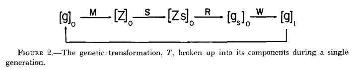

# The interaction of selection and linkage: Heterotic Model
> Yuejian Mo, 11510511

In 1960s, we known well how selection of single loci contribute to the genetic 
change in a population. The study of multiple-gene was just at start point. 
Most of the mulitple-gene formation are simply extensions of single loci models, 
which ignore the problem of linkage. Then, there were a few of papers which
invstigated for more or less special cases of selection. The results of these
inverstigations werw sufficient to show that even for two loci linkage might have
profound effects on the natural selection. Natural selection may major effect on
distribution of coupling and repulsion linkage in a population.

Here are the two-locus model from Lewontin and Kojima:
1. If the fitnesses are additive between loci, linkage does not effect the final
equilibrium state of the population.
2. If linkage is tighter than the value demanded by the magnitude of the epistasis
there may be permanent linkage disequilibrium.
3. The rate of genetic chagne with time is affected by the tightness of the
linkage.
4. In some cases stable gene frequency equilibria are possible only if linkage
is tight enough.

Although conclusions were based on two-locus model, they pointed clearly the 
importance of linkage for understanding the changes of gene frequencies in
populations. In fact, some experimental results can be understood
only if th interaction of selection and linkage is taken into account.

Here were three main modes of selection in natural and artificial populations.
The first is hetrotic models, in which heterozygots at each locus are more fit
than homozygotes. The second is the series optimum selection, in which selection
against indivi duals whose phenotypes devidate from some intermedidate optimum.
The last is unidirectional selection in which an extreme phenotype or genotype
is selected against. The linkage of there three mode are different, so I just
review the fi rst mode's linkage anaylsis.

## The mathematics of selection and linkage
Let there be two loci with two alleles each denoted by _A_,_a_ and _B_,_b_
respectively.

The operation _T_ is really a sequence of opreations and the flow from $[g]_0$
to $[g]_1$. M is the mating operator and for the case of random mating it is
the row by column multiplication of the vector $[g]_0$ by its transpose $[g]'_0$
to produce the symmetric zygotic matrix $[Z]$. 

## Heterotic Selection
There is increasing evidence that if heterosis at the locus level is importance
in natural populations, the degree of heterosis at each locus is a fucntion of the
amount of heterozygosity at other loci. In other words, the epistatic interaction
determine heterzygote superiority. Then, author assumed that epistasis will cause
an ineractino of linkage and selection at gene frequency equilibrium.

This paper examine the results of this interaction for some-locus and five-locus 
models.
The dynamics of two-locus models has been  discussed by Lewontin and 
Kojima. They present paper will examine some two-locus heterotic models in which
symmetry of fitness is not assumed, so that numerical solutions are necessary
or in which the stability of equilibria is not obvious and considerable 
numerical calculation was necessary to test the stability of the equilibria.

### Two-locus models:

It is a simple heterotic model with epistatic interation. Each locus shows
heterosis in every combination with other locus, but the heterosis is not 
additive between loci. Thus, the degree of heterosis at locus _A_ is greater
when in the presence of _Bb_ than in the presence of _BB_ or _bb_. A similar
inequality holds for the _B_ locus, where heterosis is also more pronounced
when _A_ is heterozygous than when it is homozygous. This is then a 
cumulative heterotic model, fitness increasing more rapidly the mroe loci that
are made heterozygous.

- Frist, the stable equilibrium of gametic frequencies does not correspond to
linkage equilibrium even with free recombination although the degree of linkage
disequilibrium is small. That is, there is s significant excess of coupling or
repulsion at equilibrium no matter how much recombination goes on.
- Second, there are pairs of soolutions for each recombination value, one 
corresponding to an excess of coupling and one to an excess of repulsion. Gene
frequencies change with recombination.
- Third, the mean adptive value of the population is highest when there is close
linkage and it is higher for repulsion equilibrium than for coupling equilibria.
The most profound chagne in the population due to linkage is in the genotypic
distribustion at eqbulibrium which is turn a reflection of the very large 
differences in gametic frequency from one value of linkage to another.

*Model  2*
It is slightly differrnt from Model 1. The results represents a considerable 
chagne for the first locus.

*Model 3*
This is a symmetrical model of the kind considered by L and K, but has certain
peculiarities which require careful investigation. This model is not presented
as repersenting a particular natural linkage and natural selection.

### Five-locus models:
Simplifying assumptions:
- (1).THe loci are interchagneable in their effect
- (2).THere is some heterosis for each locus, irrespecitve of whether the other
four loci are heterozygous or homozygous. This assure that all gene ferquencies
will come to a stable equilibrium of gene ferquencies at an intermediate value.
- (3).In view of (2), there is no loss of generality by further specifying that
0/0 and 1/1 homozygotes have equal fitness so that the gene frequencies at each
locus come to equilibrium at p=q=0.50.

Model 1 was chosen to have decreasing epistatis interaction with added
heterozygosity, so that the incease from four to five loci heterozygous is 
accopanied by an incerase infitness nearly equial to that fouind in the increase
from 3 to 4 loci heterozygous. However, model 2 shows a constant epistatic 
interaction from level to level of heterzygosity.

Here are three feacture.

## Correspondence to Experiments
Any extra comparison of prediction to experiment is virtually impossible with
five loci, since the fitnesses of all the genotype would be virtually impossible
to measure. However, the qualitative aspecrts of these prediction can be tested
in experimental populations in which five loci aer segregating.

# General Implications of the Results
Five-locus models add an imporatnt observation not seeni int ehtwo 
locus model
