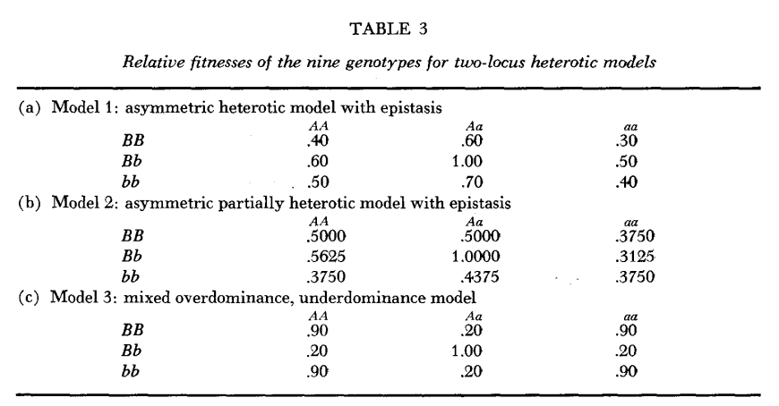
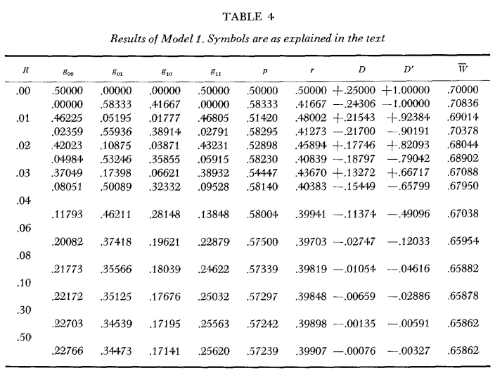
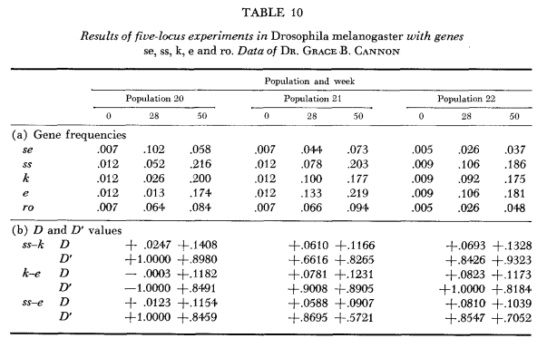

# The interaction of Selection and Linkage---Heterotic Models | 杂种优势模型

> Presentor: Yuejian Mo

> Author   : R.C. Lewontin,1963

> 2018.06.11 @ SUSTech

> Nothing in Biology Makes Sense Except in the Light of Evolution.
--- Theodosius Dobzhansky

----

# Background | What it is?

In 1960s, we known that:

- Single loci, Selection, Population genetic change

- But two-loci or mulit-loci do not.

So the paper provide some two-loci model.

> (need picture)

---

# Background | What it is?
Here are results of Lewontin and Kojima:

1. If the fitnesses are additive between loci, linkage does not effect the 
final equilibrium state of the population. 

2. If linkage is tighter than the value demanded by the magnitude of the
epistasis there may be permanent linkage disequilibrium. 

3. The rate of genetic chagne with time is affected by the tightness of the 
linkage. 

4. In some cases stable gene frequency equilibria are possible only if linkage 
is tight enough.

---

# Background | What it is?
Three main modes of selection in natural and artificial populations:

+ **Heterotic Models**

+ Series optimum selection

+ Undirectional selection(Neutral Theory)

> (need picture)

---

# Mathematics of Selection and Linkage | What is the mean?

---

# Heterotic Selection Model | How to represent? 
## Evidence:
Heterosis is important, then
$$degree\ of\ heterosis=f(number\ of\ heterozygosity)$$

## Hypothesis:
Epistatic(异位显性) 
==>
interaction of linkage and selection

## Test
- Two-locus model
- Five-locus model

---

# Heterotic Selection Model | How to represent? 

---

# Heterotic Selection Model | How to represent? 

---

# Heterotic Selection Model | How to represent? 

---

# What about the following and question?

-Epistasis is required in order for linkage to be important in natural selection.

-Five-locus models show _cumulative_ effect of the linkage along the chromosome.

